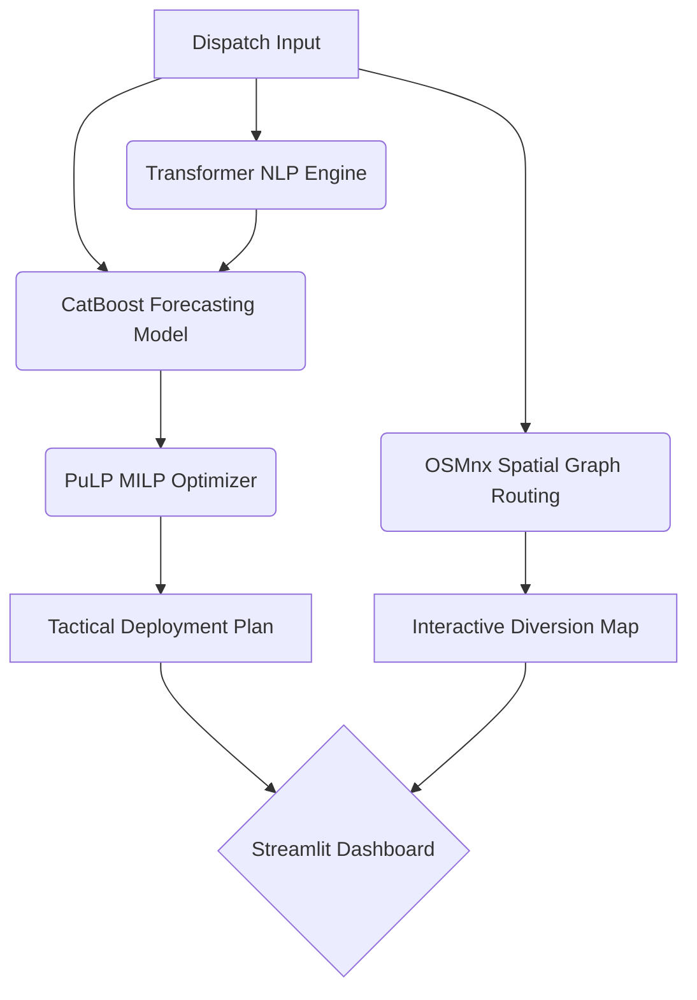

# 🚔 Astram Command Center (Team 404 Logic Found)


An AI-driven incident management dashboard designed to forecast event-driven traffic congestion and mathematically optimize police resource deployment.

## 🏆 Hackathon Project Highlights

1. **Spatial-Graph Engine (OpenStreetMap):** Dynamically calculates shortest-path diversion routes around blocked intersections using `OSMnx` and renders interactive maps with `Folium`.
2. **Deep Learning NLP:** Replaced basic keyword extraction with a HuggingFace Sentence Transformer (`all-MiniLM-L6-v2`) to extract semantic severity from mixed Kannada/English dispatch descriptions.
3. **Forecasting Engine:** Utilizes `CatBoostRegressor` to predict exact clearance durations, natively handling high-cardinality location data without massive one-hot encoding.
4. **Operations Research (Optimization):** Employs `PuLP` (Mixed-Integer Linear Programming) to replace heuristic rules, mathematically ensuring the optimal deployment of Traffic Police, Barricades, and Tow Trucks under budget constraints.

---

## 🛠️ System Architecture



## 🚀 Local Setup Instructions

1. **Clone the repository and enter the directory:**
   ```bash
   cd Round-2-Event-Congestion
   ```
2. **Install dependencies:**
   ```bash
   pip install -r requirements.txt
   ```
3. **Train the Models:** (This downloads the OSM map data and Transformer weights)
   ```bash
   python train_model.py
   ```
4. **Launch the Command Center:**
   ```bash
   streamlit run app.py
   ```
